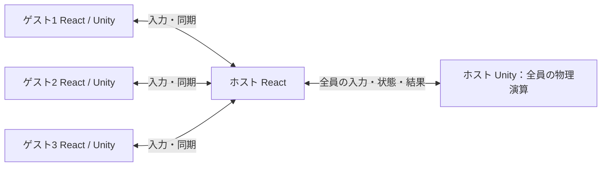

# POSE SWORD：4人対戦 仕様書・設計計画案

作成日：2026-09-07。現行ソースを確認して作成した計画案。ゲーム実装は変更していない。

## 1. 目的と前提

現在の2人対戦を維持しながら、4人が各自のブラウザ・端末から同じ部屋に参加して戦えるようにする。

ユーザーの確定要望は「4人対戦への対応」。以下は実装範囲を具体化するための推奨案であり、4人個人戦か2対2かは未確定である。

| 項目 | 初期リリースの推奨仕様 |
| --- | --- |
| 対戦形式 | 4人個人戦（全員が敵）、最後の1人が勝利 |
| 対応人数 | 部屋作成時に2人／4人を選択。選択人数が揃って開始 |
| 操作環境 | 1人1端末。現在のクリック・タップ操作を継承 |
| ゲーム種別 | 剣／独楽の両方に対応 |
| 武器作成 | 既存の撮影・切り抜き・ステータス生成を利用 |
| 脱落 | HPが0になったプレイヤーは復活せず、その試合を観戦 |
| 再戦 | 同じ部屋で全員が改めて準備して開始 |
| 初期範囲外 | 2対2、3人での開始、途中参加、再接続での試合復帰、ホスト移譲、外部観戦者 |

2対2を選ぶ場合は、勝利条件、味方への攻撃、ターゲット、配置、チーム別結果を別途定義する。以下の個人戦仕様と混在させない。

## 2. 現状と変更理由

| 現行箇所 | 確認できた実装 | 必要な変更 |
| --- | --- | --- |
| `src/App.jsx` | `connection`が1本。`mySwordData`／`enemySwordData`、相手の準備・ロード状態を個別変数で保持 | 接続集合と参加者一覧に置換 |
| `src/App.jsx` | 1人接続すると満員。両者が準備すると各端末が起動処理を行う | 定員管理とホストによる開始決定 |
| `src/App.jsx` | SYNCのどちらかのHPが0になると結果画面へ進み、HP差分から与ダメージを計算 | ホストの確定結果を表示。攻撃者別のダメージ集計 |
| `Assets/NetworkManager.cs` | `hostSword`／`clientSword`固定。受信入力は相手1人に適用 | `playerId`で剣と入力を対応付ける |
| `Assets/SceneController.cs` | 生成装置2個、左右2地点、2人向けカウントダウン | 人数に応じた生成・配置・開始処理 |
| `Assets/Sword/SwordBattle.cs` | HP0で静的な`matchEnded`を立て、カメラ停止・決着演出。倒した側のControllerも停止 | 個人脱落と試合終了を分離。撃破した人は戦闘継続 |
| 同上 | `TryAction`が端末側でも技を実行。`ExecuteRemoteAction`は技名で強制発動 | 操作要求とホストの技発動判定を分離 |
| `Assets/Sword/SwordController.cs` | `enemyTarget`が1人 | 生存者からターゲットを選択 |
| `Assets/BattleCamera.cs` | `player`／`enemy`の2点を追跡 | 生存者全員の表示範囲を計算 |
| `Assets/UI/CutinManager.cs` | 個別演出が`Time.timeScale`を書き換える | 時間制御を集約し、同時演出の競合を防止 |
| `Assets/Sword/SwordData.cs` | `BattleInitData`も2人固定 | 開始DTOを統一し、重複定義を解消 |

表の`Assets/`は`POSE_SWORD_Unity/Assets/`を指す。READMEと実装の数値には差があるため、武器パラメータの既存変換は`SwordGenerator.cs`の実装を基準に引き継ぐ。4人化と同時に攻撃力・重量のバランスを変えない。

## 3. プレイヤー向け仕様

### 3.1 ロビーと開始

1. ホストが部屋を作り、2人／4人と剣／独楽を選ぶ。既存の6桁ルームIDで招待する。
2. ロビーには定員分の枠を表示し、名前・武器画像・準備状態・接続状態・ホスト表示を出す。
3. 参加者は武器を作成または選択して「準備完了」を押す。武器を変更すると本人の準備を解除する。
4. 人数・ゲーム種別の変更、入退室では全員の準備を解除する。定員を現在人数より小さくする変更は拒否する。
5. 定員分の参加者、全員の準備、必要な武器データの受信が揃ったらホストが開始ボタンを押せる。
6. 参加者を固定してロード画面に移り、全員のUnity起動と武器・HUDの初期化完了を待つ。未完了の人を名前で表示する。
7. 全員の初期化完了後、ホストの試合時計に従う3秒カウントダウンを行い、操作を解禁する。

ロード待機は実時間60秒を仮値とし、超過したら開始を取り消してロビーへ戻す。開始前の切断も同様に取り消す。ロード中以降の新規参加は拒否し、「対戦準備中／対戦中」と伝える。

### 3.2 戦闘・脱落・勝敗

- 既存の移動、回転、SP、必殺技の基本ルールを維持する。4人個人戦では自分以外の生存者すべてに攻撃が当たる。
- HP0でその人だけを脱落させ、入力・攻撃・物理衝突を停止する。短い退場演出の後、カメラの追跡対象から外す。
- 脱落者の画面は試合表示を継続し、「観戦中」を表示する。脱落者はロビーへ退出できるが、同じ試合へ復帰できない。
- 物理ステップごとにダメージをまとめて確定し、生存者が1人なら勝利、0人なら引き分け。脱落した瞬間に試合を終了させない。
- 順位は脱落したステップで決める。同時脱落は同順位とし、順位を飛ばす方式を使う。例：4人生存から2人が同時脱落すると両者3位。
- 最後の2人が同時脱落した場合は両者同率1位、試合結果は引き分けとする。勝者IDは設定しない。
- 制限時間は初期案として設けない。長期化が問題になった場合は、実測後に制限時間と時間切れ判定を追加仕様として決める。
- 全体スロー・カメラ固定は試合終了時だけ実行する。4人戦の通常ヒット・必殺技は局所的な表示演出を基本とし、全員の時間を繰り返し止めない。

### 3.3 ターゲットとステージ

- 独楽の自動追尾と方向を持つ必殺技は、生存している最も近い敵をホストが選ぶ。同距離なら`slotIndex`順で決める。
- 通常の再選択は0.25秒間隔、新候補が現在対象より20%以上近い場合に切り替える案とする。対象の脱落時は直ちに再選択する。
- 必殺技は発動時の対象を固定し、対象が脱落したら生存者から再選択する。敵がいなくなれば追尾を止める。
- 自分の追尾対象をマーカーで表示する。手動ターゲット変更は初期範囲に含めない。
- 剣モードは床上の左右対称4地点、独楽モードは中心から等距離の4地点を配置候補にする。剣モードの上下配置は重力による有利不利があるため避ける。
- 開始地点は重なり・壁への埋まりを防ぐ距離を確保する。武器サイズ上限とステージ寸法を合わせて確認する。
- 開始地点と参加者の対応はホストが試合ごとにシャッフルして全員へ配布する。固定の中央位置などによる偏りを減らす。

### 3.4 表示と結果

- 全員のHP・SP・名前・プレイヤー番号をHUDに表示し、自分の枠を強調する。色に加えてP1～P4の番号を使う。
- 生存者全員の武器の表示範囲からカメラ中心とズームを計算する。縦横比とHUDの占有領域も考慮する。
- 拡大率の上限で生存者が画面外に出る場合は、ステージ範囲を調整するか画面端マーカーを出す。4人全体表示で操作対象を識別できることを実機で確認する。
- 開幕は全員を映したまま3秒カウントダウンする。2人向けの個別クローズアップは4人戦で使用しない。
- 結果は全員の順位、武器名・画像、与ダメージ、被ダメージ、撃破数、切断による脱落を表示する。
- 与ダメージはホストの攻撃履歴から計算し、HP差分を他人の攻撃実績として扱わない。オーバーキル分は集計しない。
- 結果画面から各自ロビーへ戻れる。全員が戻り、選択人数と準備条件を満たしたときだけ再戦できる。

### 3.5 切断

| 状況 | 動作 |
| --- | --- |
| ロビーでゲスト退出 | 当人の枠を空け、残りは部屋に残る。再募集可能 |
| ロード／カウントダウン中のゲスト切断 | 開始を中止し、残った参加者をロビーへ戻す |
| 対戦中のゲスト切断 | ホストが脱落を確定。残りで続行。切断は他人の撃破数に含めない |
| ホストがHP0で脱落 | ホストの物理演算・通信は継続。本人は観戦する |
| ホスト切断・終了 | 試合を中止し、勝敗を付けずタイトルへ戻す。ホスト移譲はしない |
| ホストが観戦中に退出操作 | 「部屋と進行中の試合が終了する」ことを画面に示して退出処理 |
| 結果確定後にホスト切断 | 受信済み結果は保持し、同じ部屋での再戦を終了 |

接続終了イベントに加え、実時間のハートビートを利用する。1秒間隔、5秒無応答で警告、10秒で切断確定を初期案とし、実機検証で調整する。確定後の復帰パケットでは脱落を取り消さない。

## 4. 設計方針

### 4.1 ホストが全員の戦闘を計算する

既存のホスト主導方式を継承し、ホストとゲスト3人を接続するスター構成を採用する。ゲスト同士は直接接続しない。これにより物理演算・勝敗の決定箇所を1つに保てる。

- ホストUnity：移動、衝突、ダメージ、SP消費、ターゲット、脱落、順位を確定する。
- ホストReact：入室枠、接続と参加者IDの対応、ロビー、ロード完了、ブロードキャストを管理する。
- ゲストUnity：自分の操作要求を送信し、受信状態を補間して表示する。HP、SP、死亡、技の成立を独自に確定しない。
- ホスト本人の入力も共通の検証・実行処理へ渡す。ネットワーク経由で自分の入力を再適用しない。
- ホスト端末への負荷集中とホスト離脱時の終了は、この構成の制約として扱う。

### 4.2 人物IDと通信役割を分離する

`HOST`／`CLIENT`は通信の役割として残し、ゲーム内の人物は`playerId`で識別する。表示位置には`slotIndex`を使い、配列順・Peer ID・ホストかどうかで操作対象を決めない。

| モデル | 主な項目 |
| --- | --- |
| Room | roomId、roomEpoch、revision、capacity、gameMode、phase、hostPlayerId、players[] |
| Player | playerId、slotIndex、displayName、connected、ready、swordRevision、swordData、loadState |
| MatchConfig | protocolVersion、roomEpoch、matchId、rosterRevision、gameMode、players[]、spawnAssignments[] |
| PlayerState | playerId、position、rotation、center、hp、sp、isDashing、dashType、targetPlayerId、lifeState |
| MatchResult | matchId、reason、winnerPlayerIds[]、draw、standings[]、finalTick |

`standings[]`は`playerId`、`rank`、`damageDealt`、`damageTaken`、`kills`、`eliminationTick`、`eliminationReason`を持つ。中止した試合では順位・勝者を確定しない。

React内部は`Map<playerId, DataConnection>`とIDによる参加者管理を使用する。Unity内部はID辞書を使用してよいが、通信DTOは既存のJSON処理に合わせてシリアライズ可能なクラスと配列にする。

ホストは接続受付時点で仮の枠を予約し、接続完了前の同時入室でも定員を超えないようにする。React stateの反映待ちに定員判定を依存させない。ハンドシェイク失敗・タイムアウト時は予約枠を解放する。

### 4.3 状態遷移と開始バリア

部屋／試合の状態は`LOBBY → LOADING → COUNTDOWN → PLAYING → RESULT → LOBBY`。中止は`ABORTED`として理由を通知する。各端末の画面状態とは分けて保持する。

1. ホストがロビーのrevisionと名簿を固定し、新しい`matchId`で`PREPARE_MATCH`を配布する。
2. 全端末はUnityロード後に設定・武器・HUDを生成し、Unityからの`BATTLE_INITIALIZED`を受けて`MATCH_READY`を返す。`isLoaded`だけでは準備完了にしない。
3. 全員の同じ`matchId`・revisionの完了が揃うとホストが`START_MATCH`を通知する。
4. ホストがカウントダウンと操作解禁を進め、SYNCにフェーズと残り時間を載せる。端末同士の壁時計一致は仮定しない。
5. 終了はホストUnityの`MATCH_RESULT`で確定する。ReactがHPを監視して結果を推測する処理は廃止する。

各通知はIDで重複適用を防ぐ。再戦時は新しい`matchId`でロード・入力連番・補間・脱落・結果・演出状態を初期化する。シーン再ロードを使う場合も、Unity初期化完了の通知を改めて待つ。

### 4.4 通信契約

全メッセージに`protocolVersion`、`roomEpoch`、`type`を付ける。試合メッセージには`matchId`を付け、異なる試合・旧バージョン・不正なフェーズのメッセージを拒否する。旧2人版との混在接続は非対応とし、更新案内を出す。

| メッセージ | 方向 | 内容・権限 |
| --- | --- | --- |
| JOIN_REQUEST / ROOM_ACCEPTED / ROOM_REJECTED | ゲスト→ホスト／応答 | バージョン、参加要求、割当ID、拒否理由 |
| ROOM_STATE | ホスト→全員 | revision付き参加者一覧と設定。ゲストは最新版のみ反映 |
| UPDATE_SWORD / SET_READY | ゲスト→ホスト | 自分の武器・準備変更要求。受信接続から本人を確定 |
| SWORD_ASSET / ASSET_ACK | ホスト↔参加者 | 武器画像の分割転送と受信確認 |
| PREPARE_MATCH / MATCH_READY / START_MATCH | ホスト→全員／完了応答 | 試合設定、初期化完了、開始 |
| INPUT | ゲスト→ホスト | seq、操作要求、方向。接続に紐付く本人の入力のみ |
| SYNC | ホスト→全員 | tick、phase、countdownRemaining、players[] |
| BATTLE_EVENT | ホスト→全員 | eventId、tick、攻撃者・対象、技、ダメージ、脱落などの演出情報 |
| MATCH_RESULT / RESULT_ACK | ホスト→全員／受信確認 | 確定結果。未確認の接続に再送 |
| MATCH_ABORTED / LEAVE / HEARTBEAT | 制御 | 中止理由、退出要求、生存確認 |

INPUTは例えば`{ type: "INPUT", matchId: "m-001", seq: 18, action: "PRIMARY", direction: "RIGHT" }`とする（共通ヘッダー省略）。技名をクライアントに決めさせず、ホストが現在のモード・SP・ダッシュ状態から成立する技を選択する。

ホストは入力連番、操作頻度、ラウンド開始、生存、SPを検証する。Unityへ渡す`playerId`はホストReactが受信接続から設定し、ゲストが送った他人のIDは信用しない。SYNC・結果・部屋設定はホストからのみ受け付ける。

JSONの必須項目、有限数値、武器ステータス範囲、文字列長・画像サイズを検証する。上限値は既存の画像出力サイズを測って決め、通信契約に固定する。

### 4.5 同期・画像転送

- 初期目標は毎秒30回の状態送信。現在の送信タイマーは`FixedUpdate`とゲーム時間に依存するため、実時間基準の送信周期へ分離する。
- 各SYNCは4人全員を含む。位置に加え、HP・SP・生存状態・試合フェーズを必須にし、イベントの欠落が状態の永久的な不一致にならないようにする。
- クライアントはtickの古い同期を捨て、短いバッファで補間する。補間遅延は50～100msを検証開始値とし、入力応答との釣り合いを測る。
- 同期送信が詰まった場合は未送信の古いSYNCを最新状態へ置き換える。開始・脱落・結果などの制御イベントは捨てず、IDとACKで確認する。
- 画像はロビーで受信・配布・キャッシュし、毎回のSYNCに含めない。`playerId + swordRevision`で管理し、既存の全画像の定期再送を受信確認方式へ置換する。
- 画像はゲスト→ホスト→他ゲストへ転送する。チャンク番号・総数・サイズを付け、受信完了後に復元・検証しACKする。準備条件は試合名簿の全画像が必要な全端末に届いたこと。
- 1回のSYNCがSバイト、送信頻度がfなら、ホスト送信量は概ね`3 × S × f`バイト/秒（通信ヘッダー等を除く）。2人から4人では剣数と宛先が増え、従来比約6倍が目安。実際のJSONサイズで測定する。

### 4.6 ダメージ確定と演出

`MatchManager`を新設し、生存者・試合状態・結果を一元管理する。`SwordBattle`は自身の戦闘処理と表示を担い、単独で試合終了フラグを変更しない。

衝突コールバックでは攻撃者ID・対象ID・接触情報を含むダメージ候補を記録し、物理ステップ完了後に集約して適用する。実装時は物理シミュレーション後に1回呼ばれる処理位置を明示し、コールバックの発生順で勝敗が変わらないようにする。

- 同一攻撃者→対象の複数コライダー接触はステップ内で統合する。相互攻撃と別プレイヤーからの攻撃は別に扱う。
- ステップ開始時の生存者の攻撃は、そのステップ内で本人が致死ダメージを受けても評価する。
- 同じ対象への合計ダメージは残HPまでを実ダメージとして扱う。複数攻撃者への実績配分は候補ダメージの比率で按分し、整数丸めの余りは小数部が大きい順、同値ならslot順で配る。
- 撃破は致死ステップで実ダメージ寄与が最大の攻撃者に付け、同値ならslot順とする。切断脱落に撃破者を付けない。
- 全員のHP・脱落を適用してから順位・残存人数を評価する。`PlayerEliminated`と`MatchEnded`を別イベントにする。
- `PlayClientDamageEffect`のHP差分からの試合終了、撃破時の攻撃者Controller停止を取り除く。
- 全体の時間変更は専用の演出管理へ集約し、終了演出が他のヒットストップ解除で巻き戻らないようにする。通信・ハートビート・ロード期限は常に実時間で動かす。

## 5. ファイルと責務の変更計画

| 対象 | 変更内容 |
| --- | --- |
| `src/App.jsx` | 画面遷移とUI組み立てに寄せ、2人固定state・勝敗推測を除去 |
| 新規`src/network/roomSession.js` | Peer接続集合、定員予約、切断、本人の特定、ブロードキャスト |
| 新規`src/network/protocol.js` | バージョン、メッセージ検証、ID、再送・ACK規約 |
| 新規`src/hooks/useBattleSession.js` | ロビー／試合状態、開始バリア、Unityとの連携 |
| 新規ロビー・結果コンポーネント | 定員分の表示と全員の結果表示 |
| `NetworkManager.cs` | ID→剣の管理、配列SYNC、本人の入力検証、実時間送信 |
| `SceneController.cs` | 共通Prefabから人数分を生成、配置、初期化完了通知 |
| `SwordData.cs` | 共通の参加者・開始DTOへ整理 |
| 新規`MatchManager.cs` | 試合状態、ステップごとの脱落判定、結果、再戦初期化 |
| 新規`TargetSelector.cs` | 生存者の検索、距離判定、ターゲット更新 |
| `SwordBattle.cs` | ダメージ候補の発行、個人脱落、ホスト判定と演出の分離 |
| `SwordController.cs` | ローカル本人の入力のみ収集。追尾対象を選択処理から取得 |
| `BattleCamera.cs` | 生存者の範囲と画面比率によるカメラ制御 |
| `CutinManager.cs`／`AudioManager.cs` | 同時演出と終了演出の整理、時間制御の集約 |
| `Assets/Scenes/SampleScene.unity`・新規Prefab | 剣とHUDのPrefab化、4地点・ステージ・シリアライズ参照の更新 |
| `ReactCommunication.jslib` | 汎用文字列ブリッジは維持し、新規イベントをReact側で処理 |
| WebGLビルド・`src/App.jsx`のロード先 | Unity再ビルドと同一バージョンのフロント配布 |

既存シーン内の剣を共通Prefabへ切り出し、UI参照を人数分の生成時に割り当てる。単に既存2本を複製するだけではInspector参照や操作対象が混線するため、Prefabとシーンの検証を実装範囲に含める。

## 6. 実装順序と完了条件

| 段階 | 作業 | 次段階へ進む条件 |
| --- | --- | --- |
| 0. 現状基準を記録 | 2端末で両モード・技・結果・再戦を確認。画像サイズ、通信量、フレーム時間を記録 | 既存挙動と既存不具合を区別できる |
| 1. 人数依存を除去 | ID・参加者配列・共通DTO・Prefab・状態管理を導入 | 新方式で2人戦が開始から再戦まで動く |
| 2. Unityの4人個人戦 | 4本生成、入力振り分け、ターゲット、脱落、順位、カメラ・HUD | Editorのテスト入力で4→3→2→1を完走し、相打ちも判定できる |
| 3. 4人ロビーと通信 | 3接続、名簿配布、画像ACK、開始バリア、配列SYNC | 4ブラウザで同じ名簿・設定・状態を共有できる |
| 4. 切断・結果・再戦 | 中止、脱落観戦、ACK、古い通信の排除、演出整理 | 切断と再戦を含む試合を繰り返して状態が混ざらない |
| 5. 実機確認と配布準備 | 4端末・異なる回線、両モード、WebGL再ビルド、説明更新 | 下記受け入れ条件を満たすビルドを用意できる |

工数は既存Prefabの切り出し、衝突集約、端末性能によって変わる。段階0～1で差分を確定し、その結果から見積もる。

## 7. 受け入れ条件と検証計画

### 正常系

- 4人が同じルームIDで参加でき、5人目が拒否される。同時接続でも定員を超えない。
- 3人しかいない4人部屋、未準備の人がいる部屋では開始できない。
- 全端末の初期化完了後に開始し、各端末の入力が本人の剣に1回だけ反映される。
- 最初の脱落で試合が終わらず、脱落者は操作できない。ホストが先に脱落しても続行する。
- 全員が同じ勝者・順位・ダメージ実績を表示する。同時脱落・全員脱落も仕様通りになる。
- 剣／独楽の両方で、ターゲットが脱落者を追い続けず、カメラとHUDが生存者を正しく示す。
- 2人戦が新方式で動き、再戦を繰り返しても前試合のHP・入力・画像・終了タイマーが残らない。

### 異常系

- ロビー・ロード・カウントダウン・戦闘・結果の各時点で、ホスト／ゲストの切断を確認する。
- 不正なplayerId、重複INPUT、古いmatchId、未知の操作、SP不足、準備前入力を適用しない。
- 遅延・一時的な通信停滞、重複通知、遅れて到着した結果で状態が逆戻りしない。
- 画像受信失敗・Unity初期化失敗・ロードタイムアウトで、全員が待機し続けず理由を表示する。
- 必殺技の同時発動や同時接触で、全体時間が停止したままにならず結果通知も届く。

### 性能とテスト方法

- プロトコル・定員予約・開始バリア・入力の所有者・再戦のID判定はJavaScriptの単体テストを用意する。
- 同時ダメージ・順位・切断脱落・ターゲット選択はUnityのテストで検証し、コールバック順を変えて同じ結果になることを確認する。
- WebGL連携、Prefab参照、タップ、画面比率、画像表示、音と演出は実機で検証する。
- 4ブラウザだけでなく4台の端末と異なるネットワークでも確認し、ホストをスマートフォンにした場合も測る。
- 暫定目標は対象端末で描画30fps以上。送信頻度、入力からホストでの反映までの時間、同期遅延、帯域、送信待ち量、メモリを測る。具体的な対象端末・回線条件は実装前に固定する。
- 対象条件で継続的な送信待ち増加や操作に支障がある場合は、同期頻度・JSON量・演出負荷を調整する。接続数だけ増やして完了としない。

## 8. 実装前に決める項目

1. 対戦形式：推奨は4人個人戦。希望が2対2なら勝敗・攻撃対象を再設計する。
2. 人数：推奨は2人／4人の選択。3人開始も必要なら人数別の配置と受け入れ条件を追加する。
3. 4人戦の演出：推奨は通常攻撃・必殺技で全体を止めず、決着時だけ全体スローにする。
4. 対象端末：最低限保証するスマートフォン・PCと画面サイズを決める。

上記以外のタイムアウト・ターゲット切替間隔などは、この案の仮値から実機検証で調整できる設定値として実装する。
